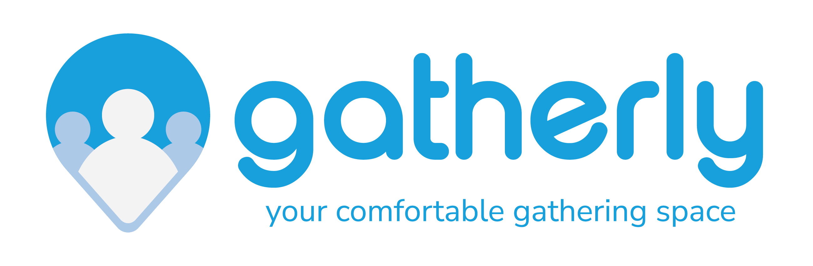

# Gatherly Frontend Web



## About Gatherly

Gatherly is a mobile based application, which helps socially isolated young people to join events and socialise. Gatherly shows events around the user based on their interests and the user can swipe left or right on the events to either skip or join the events. They can also see the event details and the number of participants before joining an event to make sure they are comfortable when attending the events. Gatherly also provides search feature for people that wants to schedule events beforehand.

## About the Repository
This repository contains the code base for web application that handles email verification and password reset

## Technology Stack
- NextJs
- TailwindCSS

## Folder Structure
<pre>
├── components: reusable components
├── configs: common configs
├── helpers: helper/utility functions 
├── network: networking configuration
├── pages: web pages following <a href="https://nextjs.org/docs/basic-features/pages">NextJs pages guide </a>
├── public: assets
└── styles: css files
</pre>


## Getting Started

### Prerequisites

Before installing the project, make sure you have [Node](https://nodejs.org/en/download/) installed

### Installation

1. Clone the repo
   ```sh
   git clone https://github.com/deco-freons/fe-web-nextjs.git 
   ```
2. Install package dependencies in `package.json`
   ```sh
   npm install
   # or
   yarn
   ```
3. Create `.env.local` file and write
   ```sh
    NEXT_PUBLIC_BASE_URL = YOUR_BACKEND_URL
   ```

### Running the Project

To run the project

```sh
npm run dev
# or
yarn dev
```

The project will run on [http://localhost:3000](http://localhost:3000)

### Building the Project

To build project

```sh
npm run build
# or
yarn build
```

### Running built project

To run the built project
```sh
npm start
# or
yarn start
```


